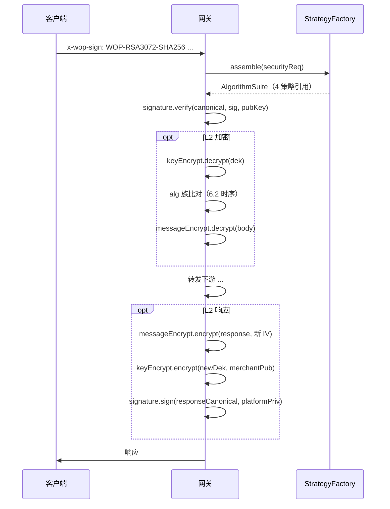

# 加密算法策略化需求 Spec

> 版本：v0.4-draft
> 日期：2026-08-31
> 状态：已评审（决策 D1–D14 冻结，见附录 C）
> 范围：仅描述**目标需求**，不涉及现有实现（绿地需求文档，D1）
> 配套测试向量：[crypto-vectors.json](crypto-vectors.json)（TEST-ONLY 密钥，跨语言字节级断言基准，附录 B.2 / D9 的载体）

---

## 1. 需求概述

### 1.1 背景

WOP 网关在处理请求时，需根据客户端在 `x-wop-sign` 中声明的 `securityReq`，确定本次通信使用的完整密码学算法组合，并在以下场景中统一使用对应算法：

- 请求验签 / 响应加签
- L2 报文加解密（含文件上传 / 下载通道，见 6.3）
- DEK（数据加密密钥）非对称包装
- 请求体摘要计算（`x-wop-content-digest`，见 3.3 ④）

### 1.2 核心需求

| ID | 需求 |
|----|------|
| R1 | 从 `securityReq` 解析出 **4 类算法** 的完整配置 |
| R2 | 每类算法独立 **策略接口 + 多实现**，新增算法只需扩展实现类 |
| R3 | 业务调用方 **只依赖策略接口**，不出现算法分支硬编码 |
| R4 | 同时支持 **国际算法** 与 **国密算法** 两套体系 |
| R5 | 映射关系固定，**集中注册于代码（单一注册表）**；扩展 = 新增实现类 + 注册行 + 解析规则，均需发版。**映射表不提供任何运行时配置入口**（D13） |

### 1.3 不在本 Spec 范围

- canonicalRequest 拼装规则
- 密钥存储与加载机制（**公钥分发编码除外**——分发格式是商户集成契约，已纳入 3.4，D12）
- LEGACY 固定密钥兼容链

---

## 2. securityReq 协议

### 2.1 格式定义

```
WOP-<密钥算法标识>-<摘要算法标识>
```

| 段 | 必填 | 说明 |
|----|------|------|
| 前缀 | 是 | 固定 `WOP` |
| 密钥算法标识 | 是 | 非对称密钥族，如 `RSA3072`、`RSA4096`、`SM2` |
| 摘要算法标识 | 是 | 哈希摘要族，如 `SHA256`、`SM3` |

### 2.2 合法取值

**密钥算法标识**

| 值 | 体系 | 说明 |
|----|------|------|
| `RSA3072` | 国际 | RSA 3072 位 |
| `RSA4096` | 国际 | RSA 4096 位 |
| `SM2` | 国密 | SM2 椭圆曲线 |

**摘要算法标识**

| 值 | 体系 | 说明 |
|----|------|------|
| `SHA256` | 国际 | SHA-256 |
| `SM3` | 国密 | SM3 |

### 2.3 合法组合与互斥

| securityReq 示例 | 是否合法 |
|------------------|----------|
| `WOP-RSA3072-SHA256` | ✅ 国际 |
| `WOP-RSA4096-SHA256` | ✅ 国际 |
| `WOP-SM2-SM3` | ✅ 国密 |
| `WOP-RSA3072-SM3` | ❌ 国际密钥 + 国密摘要，禁止 |
| `WOP-SM2-SHA256` | ❌ 国密密钥 + 国际摘要，禁止 |

### 2.4 解析失败处理

所有解析失败路径按 **10.2 错误分类总表** 归类执行（解析类 / 支持类，对外语义明确，BIZ 归属）：

| 场景 | 要求 |
|------|------|
| 空值 / 空白 | 拒绝（解析类） |
| 格式不符合三段式 / 前缀非 `WOP` | 拒绝（解析类） |
| 密钥算法或摘要算法不在支持列表 | 拒绝（支持类） |
| 国际 / 国密跨族组合 | 拒绝（支持类） |

---

## 3. 四大算法维度

从 `securityReq` 解析后，系统须推导出以下 **4 类算法**，每类算法有且仅有一个确定实现：

```
securityReq
    │
    ▼
┌───────────────────────────────────────────────────┐
│              算法套件（Algorithm Suite）            │
├─────────────┬─────────────┬─────────────┬───────────┤
│ ① 签名算法   │ ② 报文加密   │ ③ 密钥加密   │ ④ 摘要算法 │
└─────────────┴─────────────┴─────────────┴───────────┘
    │               │               │               │
    ▼               ▼               ▼               ▼
 Signature      Message         Key            Digest
 Strategy       Encrypt         Encrypt        Strategy
                Strategy        Strategy
```

### 3.1 算法映射表

| 维度 | 职责 | 国际（RSA 族） | 国密（SM2 族） |
|------|------|----------------|----------------|
| **① 签名算法** | 对 canonicalRequest 加签 / 验签 | `SHA256withRSA`（PKCS#1 v1.5） | `SM3withSM2` |
| **② 报文加密算法** | L2 信封 `encrypted` 字段对称加解密 | `AES-256-GCM/NoPadding` | `SM4-GCM/NoPadding` |
| **③ 密钥加密算法** | DEK 非对称包装（`x-wop-encrypt;dek=`） | `RSA-3072/4096/ECB/OAEPWithSHA-256AndMGF1Padding` | `SM2` |
| **④ 摘要算法** | 请求体等内容哈希（`x-wop-content-digest`） | `SHA-256` | `SM3` |

> RSA4096 套件：③ 中密钥长度替换为 4096，其余算法与国际 3072 相同（评审确认，原 Q2 关闭）。

### 3.2 推导规则

| securityReq | ① 签名 | ② 报文加密 | ③ 密钥加密 | ④ 摘要（header 标签） |
|-------------|--------|------------|------------|--------|
| `WOP-RSA3072-SHA256` | SHA256withRSA | AES-256-GCM | RSA-3072 OAEP | `sha-256` |
| `WOP-RSA4096-SHA256` | SHA256withRSA | AES-256-GCM | RSA-4096 OAEP | `sha-256` |
| `WOP-SM2-SM3` | SM3withSM2 | SM4-GCM | SM2 | `sm3` |

### 3.3 算法参数明细

#### ① 签名算法

| 算法 | JCA 标识 | 线上编码 | 说明 |
|------|----------|----------|------|
| SHA256withRSA | `SHA256withRSA` | Base64URL 无填充（RSA3072 → 恒 512 字符，RSA4096 → 恒 683 字符） | PKCS#1 v1.5；全语言原生支持 |
| SM3withSM2 | `SM3withSM2` | **裸 r‖s，固定 64 字节**（r、s 各 32 字节大端，不足左补零），Base64URL 无填充后恒 86 字符 | 评审确认（原 Q1 关闭）；**线上禁止 DER/ASN.1**，DER 只许存在于 JVM 内部，Java 侧用 BC 工具转换 |

定长编码使格式校验可前置：长度不符直接按解析类拒绝。

#### ② 报文加密算法

| 算法 | Transformation | 密钥长度 | IV 长度 | GCM Tag |
|------|----------------|----------|---------|---------|
| AES-256-GCM | `AES/GCM/NoPadding` | 32 字节 | 12 字节 | 128 bit |
| SM4-GCM | `SM4/GCM/NoPadding` | 16 字节 | 12 字节 | 128 bit |

- **密文线上格式 = `ciphertext‖tag` 尾部拼接**，整体 Base64URL 无填充。PHP `openssl_encrypt` 与 .NET `AesGcm` 的 tag 为独立出参，拼接动作在商户侧完成——集成指南必须显式说明（D10/F4）
- 加密时 **CSPRNG 随机生成 IV**，随 DEK 载荷一并传递；解密时使用 DEK 载荷中的 IV
- **同一对称密钥下 IV 永不复用**（协议不变式 I4，见 10.1）

#### ③ 密钥加密算法

| 算法 | Transformation | 说明 |
|------|----------------|------|
| RSA-3072-OAEP | `RSA/ECB/OAEPWithSHA-256AndMGF1Padding` | OAEP 摘要 SHA-256，**MGF1 摘要显式钉死 SHA-256** |
| RSA-4096-OAEP | 同上，密钥 4096 位 | |
| SM2 | SM2 公钥加密 | 线上密文 = **C1C3C2 裸拼接**（新国标 GM/T 0003），C1 = 未压缩点 `04‖X‖Y` 65 字节，整体 Base64URL 无填充，变长 |

**OAEP 参数必须显式构造**（D10/F2，头号跨语言漂移源）：

```java
new OAEPParameterSpec("SHA-256", "MGF1", MGF1ParameterSpec.SHA256, PSource.PSpecified.DEFAULT)
```

JCA 串 `OAEPWithSHA-256AndMGF1Padding` 的 MGF1 **默认是 SHA-1**，禁止依赖默认值；**label 必须为空**（与 Go 单哈希模型、Python `label=None`、WebCrypto 无 label 参数对齐）。Go / .NET / WebCrypto / Python 在"双 SHA-256"参数下天然互通。

#### ④ 摘要算法

| 算法 | 输出 | 线上格式（`x-wop-content-digest`） |
|------|------|------------------|
| SHA-256（RSA 族） | 32 字节 | `sha-256 <小写hex>` |
| SM3（SM2 族） | 32 字节 | `sm3 <小写hex>` |

格式钉（D2）：

- 值结构 = 算法标记 + **恰好一个**半角空格 + 小写十六进制；**多余空白拒绝而非容忍**（canonical header 值原样参与签名，容忍型解析 = 实现漂移温床）
- 标签与套件族强耦合：`sha-256` 仅 RSA 族、`sm3` 仅 SM2 族，跨族拒绝
- canonical 化时按统一 urlencode 规则处理（空格 → `%20`，与 `x-wop-encrypt` 的 `;`→`%3B` 同一套逻辑）
- **摘要对象 = 线上原始报文字节**：JSON 与文件统一对 wire body 整体字节计算，L2 时即密文载体
- 无 body（GET）则 header 缺席；有 body 必传。不定义"空串的摘要"中间态
- 定长摘要以 header 自描述（算法标签显式可见），验证方无需回查 securityReq 即可先做格式校验

职责定位说明：L0 明文报文下，content-digest 是**唯一**完整性防线；L2 密文下为纵深防御（GCM tag 已提供 AEAD 完整性），价值在于"先验签后解密"时锁定密文载体。

### 3.4 线上编码与密钥分发契约（D10 / D12）

| 项 | 契约 |
|----|------|
| 二进制线上编码 | Base64URL **无填充**，严格模式：服务端拒收带 `=` 的输入；各语言解码器差异（如 PHP 需 `strtr('+/','-_')`）在集成指南标注 |
| 十六进制 | 统一**小写**（.NET `BitConverter` 默认大写带连字符，商户侧经典翻车点） |
| RSA 公钥分发 | **X.509 SubjectPublicKeyInfo DER，Base64 编码**（PEM 仅作可选包装）。平台公钥下发 / 商户公钥上报同此格式 |
| SM2 公钥分发 | **未压缩点 `04‖X‖Y`（65 字节）**，Base64 编码 |
| SM2 签名 / 密文 | 见 3.3 ①③：r‖s 64B / C1C3C2 裸拼接，线上禁止 ASN.1/DER |

> 公钥分发编码历史上被划入"密钥管理"范围外，属误伤：存储是内部实现，**分发格式是商户集成契约**，与签名 / 密文格式同级（D12）。

---

## 4. 策略模式需求

### 4.1 四类策略接口

每类算法须定义独立策略接口，接口只暴露该维度的操作，不跨维度。**接口契约统一钉死**（D6）：

- 数据 / 明文 / 密文 / 对称密钥 / IV：一律 `byte[]`——无编码歧义，编解码是 infrastructure 边缘职责
- 非对称密钥：`java.security.PublicKey` / `PrivateKey`——策略 = 纯算法执行，不做 base64→Key 解析；密钥解析归 KeyCodec（可缓存解析结果）
- `MessageEncryptStrategy.encrypt` 返回 `record CipherResult(byte[] cipher, byte[] iv)`——密文与 IV 同生同传，调用方不可能拿错
- 错误传播：统一抛 **unchecked `CryptoException`**（携带维度 + 算法名 + cause），**不返回** Result 对象（Result 风格把错误处理拉回每个调用点，样板 if-fail 会重新长出来）；Filter/Service 边界负责映射错误码
- **对外模糊化纪律**：解密失败（GCM tag 不匹配）、验签失败、DEK 解包失败，返回商户的错误信息一律不区分原因细节，详细 cause 只进日志——防 padding-oracle 式信息泄露

#### SignatureStrategy（签名 / 验签）

| 方法 | 入参 | 出参 | 说明 |
|------|------|------|------|
| `sign` | `byte[] 数据`、`PrivateKey` | `byte[] 签名` | 加签 |
| `verify` | `byte[] 数据`、`byte[] 签名`、`PublicKey` | `boolean` | 验签 |

#### KeyEncryptStrategy（密钥加密 / DEK 包装）

| 方法 | 入参 | 出参 | 说明 |
|------|------|------|------|
| `encrypt` | `byte[] 明文密钥`、`PublicKey` | `byte[] 密文` | 公钥加密 |
| `decrypt` | `byte[] 密文`、`PrivateKey` | `byte[] 明文` | 私钥解密 |
| `algorithmName` | — | `String` | 日志 / 调试 |

#### MessageEncryptStrategy（报文加密）

| 方法 | 入参 | 出参 | 说明 |
|------|------|------|------|
| `encrypt` | `byte[] 明文`、`byte[] 对称密钥` | `CipherResult` | 加密并生成 IV |
| `decrypt` | `byte[] 密文`、`byte[] IV`、`byte[] 对称密钥` | `byte[] 明文` | 解密 |
| `algorithmName` / `keyLength` / `ivLength` | — | `String` / `int` / `int` | 参数描述 |

#### DigestStrategy（摘要）

| 方法 | 入参 | 出参 | 说明 |
|------|------|------|------|
| `digest` | `byte[] 数据` | `byte[] 摘要` | 计算哈希 |
| `algorithmName` | — | `String` | 如 `SHA-256` |

### 4.2 策略实现清单

| 策略接口 | 国际实现 | 国密实现 |
|----------|----------|----------|
| SignatureStrategy | RsaPkcs1SignatureStrategy | Sm2SignatureStrategy |
| KeyEncryptStrategy | RsaOaepKeyEncryptStrategy | Sm2KeyEncryptStrategy |
| MessageEncryptStrategy | Aes256GcmStrategy | Sm4GcmStrategy |
| DigestStrategy | Sha256DigestStrategy | Sm3DigestStrategy |

每个实现类：

- **无共享可变状态**（线程安全）
- **只负责单一算法**，不在内部做算法路由
- 算法参数（密钥长度、Transformation）在构造时注入
- **进程级缓存单例**（D7）：缓存键 = **算法 + 构造参数元组**（如 `RsaOaepKeyEncryptStrategy` 按 `(keyLength, oaepDigest)` 每组合一个实例；无参策略为真单例）。无状态实现没有任何请求级理由重新 new——每次 new 不是中庸默认，是纯浪费（原 Q5 关闭：day-one 设计，非可选优化）

### 4.3 策略工厂

须提供一个 **StrategyFactory**，是**唯一**的"配置→行为"绑定点：

```
StrategyFactory
├── assemble(securityReq)        → AlgorithmSuite（先纯校验，再挂 4 策略引用）
├── createSignature(suite)       → SignatureStrategy
├── createKeyEncrypt(suite)      → KeyEncryptStrategy
├── createDigest(suite)          → DigestStrategy
└── createMessageEncrypt(suite)  → MessageEncryptStrategy
```

**路由规则**（唯一算法选择入口，禁止在 Filter / Service 中重复路由）：

| 工厂方法 | 路由依据 | RSA 族 | SM2 族 |
|----------|----------|--------|--------|
| createSignature | 密钥算法族 | RsaPkcs1SignatureStrategy | Sm2SignatureStrategy |
| createKeyEncrypt | 密钥算法 + 长度 | RsaOaepKeyEncryptStrategy | Sm2KeyEncryptStrategy |
| createDigest | 摘要算法 | Sha256DigestStrategy | Sm3DigestStrategy |
| createMessageEncrypt | 密钥算法族 | Aes256GcmStrategy | Sm4GcmStrategy |

约束：

- **装配职责归工厂**：`assemble(securityReq)` 内部先做纯格式校验，再装配 AlgorithmSuite（原 5.3 伪代码的 `AlgorithmSuite.parse(securityReq, factory)` 是分层倒置——领域对象静态方法不应依赖工厂接口，已改）
- **映射表无运行时配置入口**（D13）：算法路由是安全策略，变更门槛 = 发版 + 评审
- 工厂通过依赖注入可替换（测试 Mock 工厂，E4）

### 4.4 AlgorithmSuite

`AlgorithmSuite`（命名已钉死，原 Q4 关闭）作为一次请求的算法上下文：

```
AlgorithmSuite（record，不可变）
├── securityReq          // 原始串
├── keyAlgorithm         // RSA | SM2
├── keyLength            // 3072 | 4096 | 0
├── digestAlgorithm      // SHA256 | SM3
├── signAlgorithm        // 推导后的签名算法名
├── messageAlgorithm     // 推导后的报文算法名
├── keyWrapAlgorithm     // 推导后的密钥包装算法名
│
└── strategies           // 4 策略引用（工厂一次性装配）
    ├── signature
    ├── keyEncrypt
    ├── messageEncrypt
    └── digest
```

**要求**：

- 每个请求在入口调用 `strategyFactory.assemble(securityReq)` **一次**，四维策略原子解析，不存在"半装配"窗口
- 后续 Filter / Service **只读** 该对象上的策略引用，请求生命周期内复用
- 策略实例为工厂缓存的进程级单例（4.2），AlgorithmSuite 只持引用

---

## 5. 调用需求

### 5.1 原则

| # | 原则 |
|---|------|
| C1 | 调用方通过 `AlgorithmSuite.strategies()` 获取策略，**禁止**直接 `new` 具体实现类 |
| C2 | 调用方**禁止**写 `if (RSA) … else (SM2) …` 算法分支 |
| C3 | 新增算法套件时，**只改** 解析规则 + 工厂映射 + 新增实现类 |
| C4 | **Filter / Service 禁止持有 `StrategyFactory` 引用，只持有 `AlgorithmSuite`**——`assemble` 只允许在请求入口被调用一次，其后工厂在本请求内不可再见（接口收敛到什么程度，纪律就跟进到什么程度） |

### 5.2 场景与策略对应

| 业务场景 | 使用策略 | 操作 |
|----------|----------|------|
| 入站验签 | SignatureStrategy | `verify(canonicalRequest, signature, merchantPublicKey)` |
| 出站加签 | SignatureStrategy | `sign(canonicalRequest, platformPrivateKey)` |
| DEK 解包（入站） | KeyEncryptStrategy | `decrypt(dekCipher, platformPrivateKey)` |
| DEK 包装（出站） | KeyEncryptStrategy | `encrypt(dekPayload, merchantPublicKey)` |
| L2 报文解密 | MessageEncryptStrategy | `decrypt(cipher, iv, dekKey)` |
| L2 报文加密 | MessageEncryptStrategy | `encrypt(plain, dekKey)` |
| 请求体摘要 | DigestStrategy | `digest(bodyBytes)` → 按 3.3 ④ 组装 `alg 小写hex` 比对 header |

### 5.3 调用示例（伪代码）

```java
// 1. 请求入口装配一次（C4：此后本请求不再接触工厂）
AlgorithmSuite suite = strategyFactory.assemble(securityReq);

// 2. 验签 — 直接用，无分支
boolean ok = suite.signature().verify(
    canonicalBytes, signatureBytes, merchantPublicKey);

// 3. DEK 解包
byte[] payloadPlain = suite.keyEncrypt().decrypt(dekCipher, platformPrivateKey);
DekPayload dek = DekPayload.parse(payloadPlain);

// 4. 报文解密 — alg 须与套件默认报文算法一致（校验时序见 6.2）
byte[] plain = suite.messageEncrypt().decrypt(cipherBody, dek.iv(), dek.key());

// 5. 摘要
byte[] hash = suite.digest().digest(bodyBytes);
```

### 5.4 处理路径约束（D6）

- 加解密路径**全程 `byte[]` / 流**，禁止把密文载体当 `String` 拼接（UTF-16 双倍内存 + 多副本放大）
- 文件通道**免 JSON 树处理**：与报文通道协议形态统一（同一 L2 信封），但处理路径直通 byte[] 管道，不经过 JSON 解析/构造工具链

---

## 6. DEK 载荷与报文算法一致性

### 6.1 DEK 载荷格式

```
alg$base64url(key)$base64url(iv)
```

| 字段 | 说明 |
|------|------|
| alg | 报文对称算法标识（`AES-256-GCM` / `SM4-GCM`） |
| key | 对称密钥（Base64URL 无填充） |
| iv | GCM IV（Base64URL 无填充） |

整个载荷经非对称包装后 Base64URL 无填充置于 `x-wop-encrypt: L2;dek=`。`$` 不在 Base64URL 字母表中，分隔符无碰撞。

### 6.2 alg 与套件对应关系

| 套件 | 期望 alg | alg 不一致时 |
|------|----------|--------------|
| RSA 族 | `AES-256-GCM` | 拒绝（一致性类错误） |
| SM2 族 | `SM4-GCM` | 拒绝（一致性类错误） |

**校验时序**（D8）：alg 段在 DEK 载荷明文内部，解包之前不可见。时序钉死为：

```
解包 DEK → 解析 alg → 比对套件族 →（不匹配即拒）→ 报文 bulk 解密
```

比对发生在 **bulk 解密之前**，省掉的正是占大头的对称解密开销；映射表是公开协议知识，提前比对不构成 oracle。

### 6.3 文件通道（上传 / 下载）

| 项 | 决议 |
|----|------|
| 加密形态 | 与报文通道**统一使用 L2 信封**（非对称包 DEK + 对称 bulk），不引入预共享对称密钥方案（D4） |
| 大小上限 | 单文件 **≤10MB**（按**线上请求体总字节**计，含 Base64 膨胀），超限拒绝（限额类）。**上限必须在读取过程中生效**：Content-Length 预检 + 无 Content-Length（chunked 编码）时流式计数超限即断流——拒绝若发生在读完之后，上限等于不存在 |
| 处理路径 | 见 5.4：全程 byte[]，免 JSON 树 |
| 摘要 | 与报文一致：对 wire body 整体字节计算（3.3 ④） |
| 分块流式 AEAD 信封 | **挂起，协议 v2 议题**（见"明确未决清单"） |

---

## 7. 数据流



---

## 8. 扩展性需求

| # | 需求 |
|---|------|
| E1 | 新增 RSA 密钥长度（如 RSA2048）：增加解析规则 + 工厂参数化，不改动策略接口 |
| E2 | 新增摘要算法（如 SHA384）：增加 DigestStrategy 实现 + 注册行 |
| E3 | 新增报文算法（如 AES-128-GCM）：增加 MessageEncryptStrategy 实现 + 注册行 |
| E4 | 策略工厂可替换（如测试 Mock 工厂），通过依赖注入 |
| E5 | **每语言指定唯一密码库 + 官方 SDK 覆盖矩阵**：SM4-GCM 等算法在 JS/PHP/.NET 生态无主流库支持，由平台官方 SDK 承接；集成文档给出"每语言恰好一条受支持路径"的库矩阵（见附录 B） |

---

## 9. （已移除）

原"待确认事项"五问全部关闭：Q1（SM3withSM2 确认）、Q2（RSA4096 报文算法 = AES-256-GCM 确认）、Q3（OAEP MGF1 = SHA-256，由 3.3 ③ 显式参数钉关闭）、Q4/Q5（由 4.2/4.4 关闭）。决策记录见附录 C。

---

## 10. 协议不变式与错误分类

### 10.1 协议不变式

> **验收要求：每条不变式至少配一个负向量测试，证明违反时网关会拒绝。** 正向量证明"能通"，负向量证明"会拒"，两者齐备协议才算被实现而非被复述。I4 例外：随机 IV 碰撞无法确定性构造，测试退化为"出站 IV 生成点唯一（仅策略内一处）"的结构断言 + 代码评审。
>
> 不变式的共同特征：**违反时静默失败、无报警路径**——正向联调全绿与违反不变式之间不存在任何自动信号，这是它们必须单列的原因。

| # | 不变式 | 违反场景示例 |
|---|-------|-------------|
| I1 | `x-wop-content-digest` 必入 signedHeaders——body 与签名之间唯一的绑定桥梁 | 某 Filter 允许 digest 缺签 → body 退回无保护，且无任何报错 |
| I2 | 先验签后解密 | 先解密再验签 → 网关替攻击者做了 oracle |
| I3 | DEK alg 族比对在 bulk 解密前（6.2 时序） | 跳过比对 → 白烧 10MB 级解密 |
| I4 | GCM 同一对称密钥下 IV 永不复用；出站复用入站 DEK 时必须新随机 IV（CSPRNG，12 字节） | IV 重用 = GCM 认证密钥泄露，全协议归零 |
| I5 | 算法族互斥贯穿三处：securityReq 组合（2.3）、digest 标签（3.3 ④）、dek alg（6.2） | 任何一处放行跨族 → 国密合规边界破洞 |
| I6 | 套件原子装配：入口一次（4.4），Filter/Service 禁触工厂（C4） | 散落装配 → C1 名存实亡 |
| I7 | 对外语义模糊化纪律（4.1 / 10.2） | 报错区分 tag 失败 / 密钥不符 → oracle |

### 10.2 错误分类总表

错误码编号留给实现，但**分类、归属、对外语义在 spec 冻结**；错误码本身定位为**稳定公共契约**（商户可编程处理）。

| 类 | 触发点 | 归属 | 对外语义 | 可重试 |
|----|--------|------|----------|--------|
| 解析类 | securityReq 三段式 / 前缀 / 格式 | BIZ | **明确**指出格式错误 | 否 |
| 支持类 | 算法不在列表、跨族、长度非法 | BIZ | 明确"不支持的算法组合" | 否 |
| 时效重放类 | timestamp 窗口、nonce、expiredSeconds | BIZ | 明确 | 时间窗校正后可 |
| 完整性类 | digest 不匹配 | BIZ | 明确"摘要不匹配" | 否 |
| 验签类 | 签名验证失败 | BIZ | **模糊**："签名验证失败" | 否 |
| 解密类 | DEK 解包失败、GCM tag 失败 | BIZ | **模糊**："解密失败" | 否 |
| 一致性类 | dek alg 与套件族不符 | BIZ | 明确（公开映射知识，I3 允许提前拒） | 否 |
| 限额类 | body 超上限（读中止，6.3） | BIZ | 明确"超过大小上限" | 否 |
| 系统类 | 密钥缺失、内部异常 | SYS | "系统繁忙" + traceId | 是 |

**明确 / 模糊分界原则**：鉴权前可判定的公开协议知识 → 明确（帮助商户集成自查）；依赖密钥参与的判定 → 模糊（防 oracle）。

---

## 明确未决清单

以下事项**有意**不在本 spec 内，防止读者误认为遗漏：

| 事项 | 去向 |
|------|------|
| 分块流式 AEAD 信封（协议 v2，大文件） | 后续协议设计议题（6.3 挂起） |
| LEGACY 固定密钥兼容链 | 1.3 排除 |
| canonicalRequest 拼装规则 | 1.3 排除 |
| 既有仓库实现与本 spec 的切换计划 | 实施计划阶段（D1：绿地身份决定 spec 不欠代码交代） |

---

## 附录 A：securityReq → 四策略速查

### 国际：`WOP-RSA3072-SHA256`

| 维度 | 算法 | 线上格式要点 |
|------|------|--------------|
| 签名 | SHA256withRSA（PKCS#1 v1.5） | Base64URL 无填充，恒 512 字符 |
| 报文加密 | AES-256-GCM/NoPadding | key 32B / IV 12B / tag 128b，密文 = ciphertext‖tag |
| 密钥加密 | RSA-3072 OAEP（双 SHA-256 + 空 label，**显式参数化**） | — |
| 摘要 | SHA-256 | `x-wop-content-digest: sha-256 <小写hex>` |

`WOP-RSA4096-SHA256` 同上，③ 密钥 4096 位，签名恒 683 字符。

### 国密：`WOP-SM2-SM3`

| 维度 | 算法 | 线上格式要点 |
|------|------|--------------|
| 签名 | SM3withSM2 | 裸 r‖s 64 字节，Base64URL 无填充恒 86 字符，禁 DER |
| 报文加密 | SM4-GCM/NoPadding | key 16B / IV 12B / tag 128b，密文 = ciphertext‖tag |
| 密钥加密 | SM2 | C1C3C2 裸拼接（C1 = 未压缩点 65B），Base64URL 无填充 |
| 摘要 | SM3 | `x-wop-content-digest: sm3 <小写hex>` |
| userId（ZA） | SM3withSM2 的 ZA 计算入参 | **已钉（D14，2026-08-31 飞书裁决）**：userId = 请求头 `x-wop-appkey` 值；无 appkey 视为非法输入，实现不得静默回退默认。黄金向量在 `inputs.sm2UserId` 中固定 `1234567812345678`（crypto-vectors.json）——仅作向量夹具，不构成默认值证明 |

---

## 附录 B：跨语言兼容矩阵与测试向量

### B.1 库矩阵（每语言唯一指定路径，E5）

| 语言 | RSA 签名 / OAEP | AES-GCM | SM2 / SM3 / SM4-GCM | 备注 |
|------|----------------|---------|---------------------|------|
| Java | JCA + BC | JCA | BouncyCastle | 网关侧参考实现 |
| Go | crypto/rsa（OAEP 单哈希模型天然双 SHA-256） | crypto/cipher | `emmansun/gmsm`（**勿用 `tjfoc/gmsm`，无 GCM**） | |
| Python | cryptography（OAEP/MGF1 显式双 SHA-256） | cryptography | `gmssl ≥3.2.2`（旧版无 GCM） | |
| JS (Node) | WebCrypto RSASSA-PKCS1-v1_5 / RSA-OAEP | WebCrypto AES-GCM | **官方 SDK**（sm-crypto 无 SM4-GCM） | 浏览器直连为架构禁止场景（商户私钥不得落入客户端），SDK 面向 Node 服务端 |
| PHP | **phpseclib ≥3**（openssl 扩展 OAEP 哈希写死 SHA-1，原生不可用） | openssl（tag 独立出参需拼接） | **官方 SDK** | |
| .NET | RSACng OaepSHA256 | AesGcm（tag 独立出参需拼接） | **官方 SDK**（新版运行时 SM4 尚实验性） | |

### B.2 测试向量（防漂移验收的载体，D9）

- spec 附录固化**跨语言测试向量**：固定明文 + 固定密钥 → 期望签名 / 密文字节（字节级断言）
- Java 侧单测消费向量；商户联调工具与各语言 SDK 消费同一组向量
- 覆盖面：RSA 签名验签、OAEP 包装解包、AES-256-GCM、SM2 签名（r‖s）/ 密文（C1C3C2）、SM3 / SHA-256 摘要、digest header 组装
- 负向量见 10.1：每条不变式至少一个"必须拒"用例
- 可选演进：向量以机器可读 JSON golden files 形式由 CI 同时消费（文档即测试夹具，漂移即红灯）

---

## 附录 C：评审决策记录（D1–D14）

| # | 决议 |
|---|------|
| D1 | spec 身份 = 绿地需求文档；仓库切换计划移交实施计划阶段 |
| D2 | `x-wop-content-digest: <alg> <小写hex>`（sha-256 / sm3 随套件），恰好一空格，多余空白拒绝，跨族拒绝；摘要对象 = wire 原始字节；无 body 缺席、有 body 必传 |
| D3 | digest 入 signedHeaders = 协议不变式（I1），与"先验签后解密"同级 |
| D4 | 文件通道 = 现有 L2 信封，实现统一；预共享对称密钥方案废弃 |
| D5 | 上限按线上请求体总字节计（≤10MB），Content-Length 预检 + 流式计数超限即断；分块流式 AEAD 挂起为协议 v2 |
| D6 | 接口契约：byte[] 数据 / JCA Key 密钥 / CipherResult / unchecked CryptoException / 对外模糊化对内详日志 / 加解密路径全程 byte[] / 文件通道免 JSON 树 |
| D7 | AlgorithmSuite 聚合 + 策略按"算法+参数元组"进程级缓存单例（day-one）+ `factory.assemble` 装配职责归工厂 + C4 |
| D8 | DEK alg 族比对在解包后、bulk 解密前，不匹配即拒 |
| D9 | SM2 三钉：签名 r‖s 64B / 密文 C1C3C2 裸 / 线上禁 ASN.1；跨语言测试向量为验收机制 |
| D10 | RSA 族钉：OAEP 显式参数化（双 SHA-256 + 空 label）/ 密文 tag 尾拼 / 小写 hex / 严格无填充 base64url / phpseclib 注记 |
| D11 | SM4-GCM 维持；JS/PHP/.NET 由官方 SDK 承接；新增 E5 |
| D12 | 公钥分发编码（SPKI Base64 / SM2 未压缩点）移入协议章节 3.4 |
| D13 | R5 改写：映射集中注册于代码，扩展需发版，无运行时配置入口 |
| D14 | **userId 契约已钉（2026-08-31 飞书裁决）**：SM3withSM2 的 ZA 计算 userId = 请求头 `x-wop-appkey` 值；无 appkey 视为非法输入，实现不得静默回退默认（排除 sm-crypto-v2 空串默认）。黄金向量在 `inputs.sm2UserId` 固定 `1234567812345678` 仅作向量夹具，不构成默认值证明 | **已钉**（2026-08-31） |
